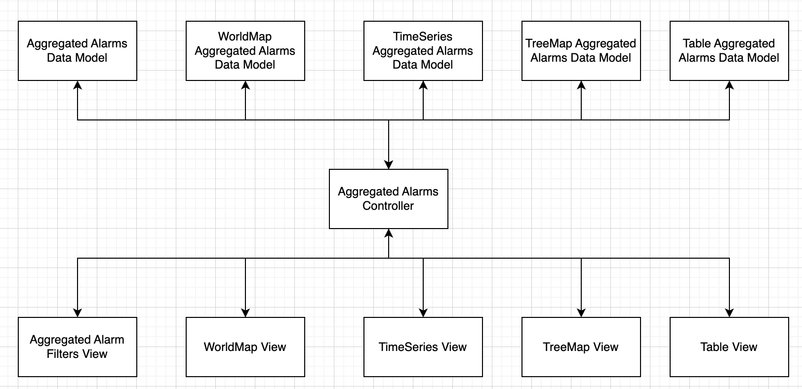
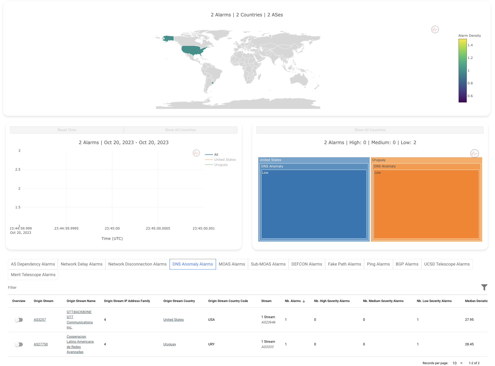

# Table of Contents

- [How to Add Alarm Type](#how-to-add-alarm-type)
  - [Step 1: Choose Your Data Source](#step-1-choose-your-data-source)
  - [Step2: Dataset Requirements](#step2-dataset-requirements)
  - [Step3: Adding Alarm Types to the Dashboard](#step3-adding-alarm-types-to-the-dashboard)
  - [Step4: Adding IHR DNS Anomaly Alarm Type to the Dashboard (Demo)](#step4-adding-ihr-dns-anomaly-alarm-type-to-the-dashboard-demo)
    - [Step4.1: Metadata](#step41-metadata)
    - [Step4.2: Extracting the IHR DNS Anomaly Data](#step42-extracting-the-ihr-dns-anomaly-data)
    - [Step4.3: Integrating DNS Anomaly Alarms with Other IHR Alarms](#step43-integrating-dns-anomaly-alarms-with-other-ihr-alarms)
    - [Step4.4: Successful Integration of DNS Anomaly Alarms into the Dashboard 🚀](#step44-successful-integration-of-dns-anomaly-alarms-into-the-dashboard-)
- [How to Add Data Source](#how-to-add-data-source)
- [How to Change the Selected Alarm Types by Default](#how-to-change-the-selected-alarm-types-by-default)
- [How to Change the Default Group By Keys](#how-to-change-the-default-group-by-keys)
- [How to Modify Text Content in the Dashboard](#how-to-modify-text-content-in-the-dashboard)
  - [How to Modify Text Content in the Filters Area and Data Visualizations (WorldMap, TimeSeries, and TreeMap)](#how-to-modify-text-content-in-the-filters-area-and-data-visualizations-worldmap-timeseries-and-treemap)
    - [To Change the Data Source Name in the Table Filters Area:](#to-change-the-data-source-name-in-the-table-filters-area)
    - [To Alter the Alarm Type Name in the Table Filters Area and Data Visualizations:](#to-alter-the-alarm-type-name-in-the-table-filters-area-and-data-visualizations)
    - [To Adjust Group By Key Names in the Table Filters Area:](#to-adjust-group-by-key-names-in-the-table-filters-area)
  - [How to Customize Text Content in the Table Data Visualization](#how-to-customize-text-content-in-the-table-data-visualization)
    - [To Modify the Text of the Button in the Table Data Visualization:](#to-modify-the-text-of-the-button-in-the-table-data-visualization)
    - [To Revise Table Column Names:](#to-revise-table-column-names)

# How to Add Alarm Type

## Step 1: Choose Your Data Source

Before adding a data source to your dashboard, you need to determine where your data will come from. Common data sources include databases, APIs, spreadsheets, and other data storage systems. Once you've selected your data source, make sure you have the necessary access credentials, API keys, or connection details.

## Step2: Dataset Requirements

Our dashboard is currently designed to work with specific attributes: Autonomous System, Country, Time, and Severity Granularities. To ensure proper functionality across all data visualizations, your dataset must include the following: autonomous system number, country ISO code 3 (mandatory for the world map), timebin (mandatory for the time series), deviation (mandatory for the treemap), and country ISO code 2 (optional but convenient for inclusion).

## Step3: Adding Alarm Types to the Dashboard

To add an alarm type to the dashboard, it's essential to understand the following context: we have approximately 3 data sources and 11 alarm types, with each alarm type considered a data source with its complex schema and time variation. To avoid accidental complexity, we follow the Extract Transform Load (ETL) with Model View Controller (MVC) architecture, allowing each step to evolve independently. Adopting this approach ensures maintainable and testable code over time.

If the alarm type you want to add is sourced from IHR, it's advisable to use the IHR API Vue.js client to benefit from caching or debouncing API calls. To do this, place the extraction code in the Aggregated Alarms Controller and handle transformation and loading steps in the Aggregated Alarms Data Model. If the alarm type comes from other data sources, perform all ETL steps in the Aggregated Alarms Data Model.


## Step4: Adding IHR DNS Anomaly Alarm Type to the Dashboard (Demo)

### Step4.1: Metadata

When writing your configuration, pay attention to the `columns`, `name`, and `field` values, ensuring they access the same attribute name. Also, distinguish between the key and alternative key to enable proper grouping by different keys. For example, I distinguished the key as `main_stream` and the alternative key as `alternative_stream`. Make sure that attributes related to each key start with the respective prefix, except for `timebin,` `severity`, `deviation`, and `count`, as they are related to the alarm as a whole and not specific to each key. Review other metadata in the file for a better understanding of the pattern.

Add the following metadata under the `ihr` data source in the `AggregatedAlarmsMetadata.js` file:

```javascript
dns_anomaly: {
    columns: {
        dns_anomaly_main_stream: [],
        dns_anomaly_main_stream_name: [],
        dns_anomaly_main_stream_country: [],
        dns_anomaly_main_stream_country_iso_code2: [],
        dns_anomaly_main_stream_country_iso_code3: [],
        dns_anomaly_main_stream_af: [],
        dns_anomaly_alternative_stream: [],
        dns_anomaly_alternative_stream_name: [],
        dns_anomaly_alternative_stream_country: [],
        dns_anomaly_alternative_stream_country_iso_code2: [],
        dns_anomaly_alternative_stream_country_iso_code3: [],
        dns_anomaly_alternative_stream_af: [],
        dns_anomaly_count: [],
        dns_anomaly_timebin: [],
        dns_anomaly_severity: [],
        dns_anomaly_deviation: []
    },
    metadata: {
        title: 'DNS Anomaly',
        table_button_text: 'DNS Anomaly Alarms',
        description: 'DNS Anomaly Alarms',
        showHelpModal: false,
        default_key: 'main_stream',
        group_by_key_options: { origin_stream: 'main_stream', stream: 'alternative_stream' },
        is_default_selected: false,
        table_columns: [
            { name: 'overview', label: 'Overview', align: 'center' },
            { name: 'main_stream', required: true, label: 'Origin Stream', align: 'left', field: row => row.main_stream, format: val => `${val}`, sortable: true },
            { name: 'main_stream_name', required: true, label: 'Origin Stream Name', align: 'left', field: row => row.main_stream_name, format: val => `${val}`, sortable: false },
            { name: 'main_stream_af', required: true, label: 'Origin Stream IP Address Family', align: 'left', field: row => row.main_stream_af, format: val => `${val}`, sortable: true },
            { name: 'main_stream_country', required: true, label: 'Origin Stream Country', align: 'left', field: row => row.main_stream_country, format: val => `${val}`, sortable: true },
            { name: 'main_stream_country_iso_code3', required: true, label: 'Origin Stream Country Code', align: 'left', field: row => row.main_stream_country_iso_code3, format: val => `${val}`, sortable: true },
            { name: 'alternative_stream', required: true, label: 'Stream', align: 'left', field: row => row.alternative_stream, format: val => `${val}`, sortable: true },
            { name: 'alternative_stream_name', required: true, label: 'Stream Name', align: 'left', field: row => row.alternative_stream_name, format: val => `${val}`, sortable: false },
            { name: 'alternative_stream_af', required: true, label: 'Stream IP Address Family', align: 'left', field: row => row.alternative_stream_af, format: val => `${val}`, sortable: true },
            { name: 'alternative_stream_country', required: true, label: 'Stream Country', align: 'left', field: row => row.alternative_stream_country, format: val => `${val}`, sortable: false },
            { name: 'alternative_stream_country_iso_code3', required: true, label: 'Stream Country Code', align: 'left', field: row => row.alternative_stream_country_iso_code3, format: val => `${val}`, sortable: true }
            ],
        table_aggregated_columns: [
            { name: 'total_count', required: true, label: 'Nb. Alarms', align: 'left', field: row => row.total_count, format: val => `${val}`, sortable: true },
            { name: 'high_severity_count', required: true, label: 'Nb. High Severity Alarms', align: 'left', field: row => row.high_severity_count, format: val => `${val}`, sortable: true },
            { name: 'medium_severity_count', required: true, label: 'Nb. Medium Severity Alarms', align: 'left', field: row => row.medium_severity_count, format: val => `${val}`, sortable: true },
            { name: 'low_severity_count', required: true, label: 'Nb. Low Severity Alarms', align: 'left', field: row => row.low_severity_count, format: val => `${val}`, sortable: true },
            { name: 'deviation_median', required: true, label: 'Median Deviation', align: 'left', field: row => row.deviation_median, format: val => `${val}`, sortable: true },
            { name: 'deviation_avg', required: true, label: 'Average Deviation', align: 'left', field: row => row.deviation_avg, format: val => `${val}`, sortable: true }
            ]
    }
}
```

### Step4.2: Extracting the IHR DNS Anomaly Data

The DNS anomaly data we want to extract is sourced from IHR. To gain an understanding of the integration process, I've hardcoded simulated data. In the `AggregatedAlarmsController.js` file, please follow these steps to add the DNS anomaly and its related method. Note that the event type is tagged with the `event_type` attribute.

```javascript
...
ihrAlarms: {
    hegemony: {
        data: null,
        extract: this.extractHegemonyAlarms
    },
    network_delay: {
        data: null,
        extract: this.extractNetworkDelayAlarms
    },
    network_disconnection: {
        data: null
    },
    dns_anomaly: {
        data: null,
        extract: this.extractDNSAnomalyAlarms // Added here
    }
}
...
extractDNSAnomalyAlarms() {
if (this.ihrAlarms.dns_anomaly.data !== null) return
const staticData =  [{
    "event_type": "dns_anomaly",
    "dns_anomaly_main_stream": 27750,
    "dns_anomaly_main_stream_type": "AS",
    "dns_anomaly_main_stream_name": 27750,
    "dns_anomaly_main_stream_country": null,
    "dns_anomaly_main_stream_country_iso_code2": null,
    "dns_anomaly_main_stream_country_iso_code3": null,
    "dns_anomaly_main_stream_af": 4,
    "dns_anomaly_alternative_stream": 3333,
    "dns_anomaly_alternative_stream_type": "AS",
    "dns_anomaly_alternative_stream_name": 3333,
    "dns_anomaly_alternative_stream_country": null,
    "dns_anomaly_alternative_stream_country_iso_code2": null,
    "dns_anomaly_alternative_stream_country_iso_code3": null,
    "dns_anomaly_alternative_stream_af": 4,
    "dns_anomaly_count": 1,
    "dns_anomaly_timebin": 1697845500,
    "dns_anomaly_severity": "low",
    "dns_anomaly_deviation": 28.4518378612748
    },
    {
    "event_type": "dns_anomaly",
    "dns_anomaly_main_stream": 3257,
    "dns_anomaly_main_stream_type": "AS",
    "dns_anomaly_main_stream_name": 3257,
    "dns_anomaly_main_stream_country": null,
    "dns_anomaly_main_stream_country_iso_code2": null,
    "dns_anomaly_main_stream_country_iso_code3": null,
    "dns_anomaly_main_stream_af": 4,
    "dns_anomaly_alternative_stream": 22646,
    "dns_anomaly_alternative_stream_type": "AS",
    "dns_anomaly_alternative_stream_name": 22646,
    "dns_anomaly_alternative_stream_country": null,
    "dns_anomaly_alternative_stream_country_iso_code2": null,
    "dns_anomaly_alternative_stream_country_iso_code3": null,
    "dns_anomaly_alternative_stream_af": 4,
    "dns_anomaly_count": 1,
    "dns_anomaly_timebin": 1697845500,
    "dns_anomaly_severity": "low",
    "dns_anomaly_deviation": 27.9531828230822
    }
    ]
}
```

### Step4.3: Integrating DNS Anomaly Alarms with Other IHR Alarms

In the `AggregatedAlarmsDataModel.js` file, update the `transformIHRAlarms` method to incorporate the DNS anomaly alarms into the aggregation. The following code snippet demonstrates how to join the DNS anomaly alarms with other IHR alarms:

```javascript
const ihrAlarmsJoined = [, /*Oher IHR Alarms */ ...dnsAnomalyAlarmsTransformed]
```

### Step4.4: Successful Integration of DNS Anomaly Alarms into the Dashboard 🚀

You can confirm this integration through data visualization, and I've verified it for you. Here's a snapshot of the DNS Anomaly Alarm Type Integration:


# How to Add Data Source

To add a data source effectively, it's important to understand the process of adding an alarm type and how it integrates with other data sources, such as `IHR`, `GRIP`, and `IODA`. Please refer to the sections above for detailed instructions on adding alarm types and the broader integration process.

# How to Change the Selected Alarm Types by Default

To modify the default selection of alarm types for the data visualizations, simply locate and update the `is_default_selected` attribute within the `AggregatedAlarmsMetadata.js` file. To modify the initial selected alarm type in the table data visualization, simply update `INITIAL_TABLE_ALARM_TYPE_SELECTED` variable in `AggregatedAlarmsController.js` file make sure it matches with the alarm type in `AggregatedAlarmsMetadata.js`.

# How to Change the Default Group By Keys

To adjust the default group by keys, you can easily do so by modifying the `default_key` attribute in the `AggregatedAlarmsMetadata.js` file to match one of the values listed in the `group_by_key_options` attribute.

# How to Modify Text Content in the Dashboard

You have the flexibility to customize and alter the text content within the dashboard by making modifications in the `AggregatedAlarmsMetadata.js` file. For more detailed information, please refer to the following sections.

## How to Modify Text Content in the Filters Area and Data Visualizations (WorldMap, TimeSeries, and TreeMap)

### To Change the Data Source Name in the Table Filters Area:

Please review and update the `title` attribute within the metadata for the specific data source in the `AggregatedAlarmsMetadata.js` file.

### To Alter the Alarm Type Name in the Table Filters Area and Data Visualizations:

To modify the Alarm Type name displayed in the table filters area and data visualizations, navigate to the `title` attribute of the respective alarm type in the `AggregatedAlarmsMetadata.js` file.

### To Adjust Group By Key Names in the Table Filters Area:

To change the names of group by keys in the table filters area, refer to the `group_by_key_options` attribute in the `AggregatedAlarmsMetadata.js` file. Modify the key as needed to match the desired UI appearance. For instance, if you want to change "source" to "source_startpoint," you can update it like this:
From:

```javascript
{ source: 'startpoint', destination: 'endpoint' }
```

To:

```javascript
{ source_startpoint: 'startpoint', destination: 'endpoint' }
```

Note: The keys in this context are related to the UI, as they map what appears in the UI to the corresponding dataset elements.

## How to Customize Text Content in the Table Data Visualization

### To Modify the Text of the Button in the Table Data Visualization:

- To change the text of the button in the table data visualization, adjust the `table_button_text` attribute within the `AggregatedAlarmsMetadata.js` file.

### To Revise Table Column Names:

- To update the names of table columns, you can modify the `label` attribute within the `table_columns` and `table_aggregated_columns` in the `AggregatedAlarmsMetadata.js` file to reflect the desired column labels.
