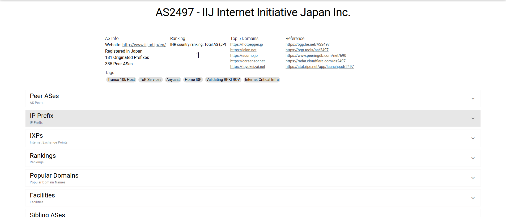

# IYP Views

Internet Yellow Pages (IYP) is a knowledge graph (a Neo4j graph database) for Internet resources. You can visualize IYP data on IHR with the IYP Views tool (select tools -> IYP Views in the top menu).

Here's a page specific to an Autonomous System (AS):



As you can see on the page, the data is separated into expansion items. Clicking on an expansion item will fetch the data and render the components. You can find the code in the `AS.vue` component. Here's a 10-step process that will take place when an expansion item is clicked:

1. The `handleClick` method will be called in order to fetch the necessary data that is specific to that expansion item through querying the IYP.
2. The queries will be divided into separate methods according to the expansion items.
3. For example, if we take the `IP Prefix` expansion item, then the method that returns a query will be `getIpPrefix`.
4. `getIpPrefix` will return an object with params, mapping (used to construct a response object), data key (see point number 8 to understand), and a query.
5. This object will be passed as an argument to the `run` method from the `IypApi.js` module.
6. The response returned by the `run` method will be something like this (which is raw from the Neo4j client),

```
[
  {
    "keys": [
      "cc",
      "prefix",
      "af",
      "tags"
    ],
    "length": 4,
    "_fields": [
      "JP",
      "101.128.128.0/17",
      {
        "low": 4,
        "high": 0
      },
      [
        "RPKI Valid",
        "IRR Valid"
      ]
    ],
    "_fieldLookup": {
      "cc": 0,
      "prefix": 1,
      "af": 2,
      "tags": 3
    }
  },
  {
    "keys": [
      "cc",
      "prefix",
      "af",
      "tags"
    ],
    "length": 4,
    "_fields": [
      "JP",
      "103.2.57.0/24",
      {
        "low": 4,
        "high": 0
      },
      [
        "Anycast",
        "IRR Valid",
        "RPKI Valid"
      ]
    ],
    "_fieldLookup": {
      "cc": 0,
      "prefix": 1,
      "af": 2,
      "tags": 3
    }
  },
  {
    "keys": [
      "cc",
      "prefix",
      "af",
      "tags"
    ],
    "length": 4,
    "_fields": [
      "JP",
      "103.2.58.0/23",
      {
        "low": 4,
        "high": 0
      },
      [
        "IRR Valid",
        "RPKI Valid"
      ]
    ],
    "_fieldLookup": {
      "cc": 0,
      "prefix": 1,
      "af": 2,
      "tags": 3
    }
  }
]
```

7. The raw response will be passed as an argument to the `formatResponse` method from the `IypApi.js` module to format it to the below desired response (which is an array of objects):

```
[
    {
        af: 4,
        cc:"JP",
        prefix: "101.128.128.0/17",
        tags: ["RPKI Valid", "IRR Valid"]
    },
    {
        af: 4,
        cc:"JP",
        prefix: "103.2.57.0/24",
        tags: ["Anycast", "IRR Valid", "RPKI Valid", ]
    },
    {
        af: 4,
        cc:"JP",
        prefix: "103.2.58.0/23",
        tags: ["IRR Valid", "RPKI Valid"]
    }
]
```

8. The formatted response will be assigned to a key called `ipPrefixes` in the `data` object using the `data` key that is present in an object returned by the `getPrefixes` method.
9. This data will be passed to the `GenericTable.vue` component to render a table.
10. Also, the data will be passed to components that render a chart using Plotly. In this case, it will be passed to the `GenericPieChart.vue` and `GenericBarChart.vue` components to render a pie and a bar chart.

The above process will be the same for every expansion item. Apart from the AS page, there are dedicated pages for Country (Country.vue), IXP (IXP.vue), and Prefix (Prefix.vue). These pages will also have an identical layout to the AS page.