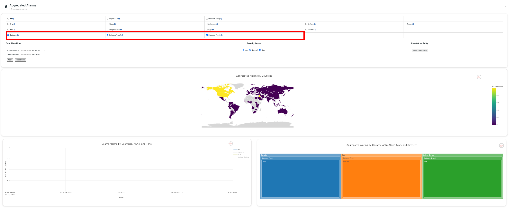

# How to add Internet Alarms Data Source and Integrate with Aggregated Alarms Data Visualizations

This guide will walk you through the process of creating a fake alarms data source named "outages" and integrating it with Aggregated Alarms Data Visualization.

## Step 1: Alarms Metadata and Data Source Setup

1. Open the `AggregatedAlarmsController.vue` file.
2. Add the alarms metadata information for the "outages" data source under the `Alarms info` section:
```javascript
// Alarms info in AggregatedAlarmsController
const alarmsInfo = {
    // Other data sources...
    outages: {
        outages_type1_alarm_counts: [],
        outages_type1_alarm_timebins: [],
        outages_type1_alarm_severities: [],
        outages_type2_alarm_counts: [],
        outages_type2_alarm_timebins: [],
        outages_type2_alarm_severities: [],
    }
};
```
3. Add metadata for the "outages" data source and its equivalent alarm types:
```javascript
// Alarms info in AggregatedAlarmsController
const alarmsInfo = {
    // Other data sources...
    outages: {
        alarm_types: {
            outages_type1: {
                description: 'Outages Type1 Alarm Type',
                showHelpModal: false
            },
            outages_type2: {
                description: 'Outages Type2 Alarm Type',
                showHelpModal: false
            }
        },
        description: 'Outages Data Source',
        showHelpModal: false
    }
};
```
4. Create a state to manage downloading and data for the "outages" data source in the `AggregatedAlarmsController`:
```javascript
// Alarms info in AggregatedAlarmsController
const thirdPartyAlarmsStates = {
    grip: { downloading: false, data: null },
    ioda: { downloading: false, data: null },
    outages: { downloading: false, data: null }
};
```
## Step 2: Creating the Outages Plugin for Data Extraction
1. Create a file named `OutagesAPI.js` in `src/plugins/OutagesApi.js`.
2. Populate `OutagesAPI.js` with the following content:
```javascript
// OutagesAPI.js
export function getOutagesAlarms(outagesAlarmsState, startTime, endTime) {
    const request = () => {
        return new Promise((resolve, reject) => {
            // Check if data is already available
            if (outagesAlarmsState.data) {
                return resolve(outagesAlarmsState.data);
            }
            // If data is not available and not downloading, initiate download
            if (!outagesAlarmsState.data && !outagesAlarmsState.downloading) {
                outagesAlarmsState.downloading = true;
                getOutagesAlarmsHelper(startTime, endTime)
                    .then((outagesAlarms) => {
                        outagesAlarmsState.downloading = false;
                        outagesAlarmsState.data = outagesAlarms;
                        return resolve(outagesAlarmsState.data);
                    })
                    .catch(error => {
                        return reject(error);
                    });
            }
        });
    };
    return request();
}

function getOutagesAlarmsHelper(startTime, endTime, timezone = '00Z', entityType = 'asn') {
    return Promise.resolve([
        {
            "datasource": "outages_type1",
            "entity": {
                "code": "26198",
                "name": "AS26198 (NETRIUM-NETWORKS)",
                "type": "asn",
                "attrs": {
                    "fqid": "asn.26198",
                    "name": "NETRIUM-NETWORKS",
                    "org": "3Men@Work Integrated Networks, Inc.",
                    "ip_count": "27904"
                }
            },
            "time": 1689862800,
            "level": "critical",
        },
        {
            "datasource": "outages_type1",
            "entity": {
                "code": "203217",
                "name": "AS203217 (HZ)",
                "type": "asn",
                "attrs": {
                    "fqid": "asn.203217",
                    "name": "HZ",
                    "org": "Horizon Scope Mobile Telecom WLL",
                    "ip_count": "6912"
                }
            },
            "time": 1689862800,
            "level": "normal",
        },
        {
            "datasource": "outages_type2",
            "entity": {
                "code": "394700",
                "name": "AS394700 (THE-SCHOOL-DISTRICT-OF-PALM-BEACH-COUNTY)",
                "type": "asn",
                "attrs": {
                    "fqid": "asn.394700",
                    "name": "THE-SCHOOL-DISTRICT-OF-PALM-BEACH-COUNTY",
                    "org": "The School District of Palm Beach County",
                    "ip_count": "4864"
                }
            },
            "time": 1689862800,
            "level": "low",
        },
    ]);
}
```
## Step 3: Integrating the Outages Plugin
1. Import the `getOutagesAlarms` function in `AggregatedAlarmsController.vue`:
```javascript
// AggregatedAlarmsController.vue
import { getOutagesAlarms } from "@/plugins/OutagesApi";
```
2. Inside the `extractAlarms` function of `AggregatedAlarmsDataModel`, call the `getOutagesAlarms` function:
```javascript
// AggregatedAlarmsController.vue
const outagesAlarmsPromise = dataSourcesSelected.outages
    ? getOutagesAlarms(thirdPartyAlarmsStates.outages, startTime, endTime)
    : Promise.resolve([]);
```
3. Store the extracted outages alarms after resolving the promises:
```javascript
// AggregatedAlarmsController.vue
Promise.all([..., outagesAlarmsPromise])
    .then(([..., outagesAlarms]) => {
        // Storing other data sources sources 
        extractedAlarms.outages = outagesAlarms;
        return resolve(extractedAlarms);
    })
    .catch((error) => {
        return reject(error);
    });
```
## Step 4: Data Transformation
1. Inside `dataSourcesTransformers` in `AggregatedAlarmsController.vue`, add metadata for the outages transformation function:
```javascript
// AggregatedAlarmsController.vue
dataSourcesTransformers: {
    // Other data sources...
    outages: {
        transformFunc: transformOutagesAlarms
    }
}
```
2. Create the `transformOutagesAlarms` function:
```javascript
// AggregatedAlarmsController.vue
function transformOutagesAlarms(outagesAlarms, outagesAggregatedAttrs) {
    // Transformation logic for outages alarms
    const outagesAlarmsTransformed = filterOutagesAlarms(outagesAlarms);
    const outagesAlarmsSeveritiesTransformed = transformAlarmsSeverities(outagesAlarmsTransformed, outagesSeverityMapper)
    const outagesAlarmsAggregated = aggregateAlarms(outagesAlarmsSeveritiesTransformed, outagesAggregatedAttrs);
    return outagesAlarmsAggregated;
}


function filterOutagesAlarms(outagesAlarms) {
    // Filtering logic for outages alarms
    const outagesAlarmsNonEmpty = outagesAlarms.filter((alarm) => Object.keys(alarm).length)
    const outagesAlarmsTransformed = outagesAlarmsNonEmpty.reduce((acc, curr) => {
        const asnName = curr.entity.attrs.name ? curr.entity.attrs.name : curr.entity.attrs.org
        const asnNumber = curr.entity.code
        const eventType = curr.datasource.replace('-', '_')
        const outagesSeverityLevel = curr.level
        const eventLocalDateTime = new Date(curr.time * 1000)
        const eventUTCDateTimeFormatted = formatUTCTime(eventLocalDateTime, '00Z')

        const outagesAlarm = {
            asn_name: asnName,
            asn: asnNumber,
            country_iso_code2: null,
            timebin: eventUTCDateTimeFormatted,
            event_type: eventType,
            severity: outagesSeverityLevel,
        };
        acc.push(outagesAlarm);
        return acc;
    }, []);
    return outagesAlarmsTransformed;
}
```
And that's it! You've successfully added the "outages" Internet Alarms Data Source and integrated it with Aggregated Alarms Data Visualization.

